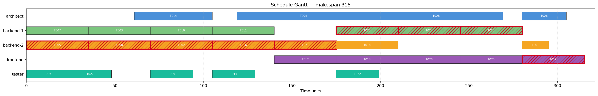
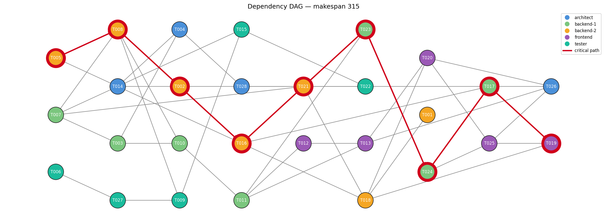
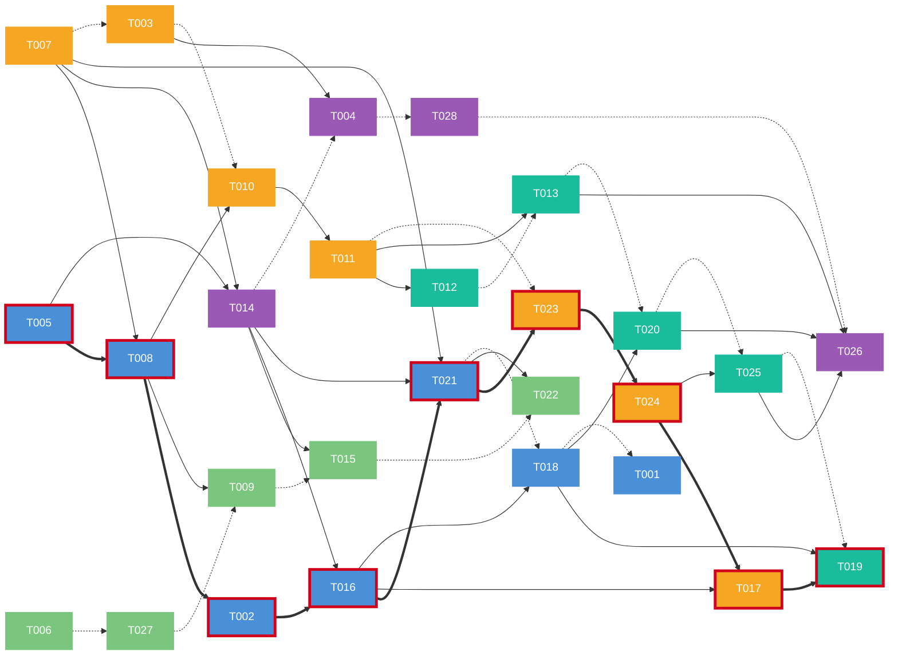

# Schedule — Create Taskify

> Generated by `/speckit.schedule` — CP-SAT Multi-Agent Optimizer
> Status: **OPTIMAL** | Makespan: **315** time units | Waves: **13** | Agents: **5**

---

## Agent Assignments

### architect (claude-opus-4) — 4 tasks, 17,500 tokens (36.5% budget, 50.0% κ)

- **T014** [US2] t=61→105 | `src/models/task.ts`
- **T004** [Foundational] t=119→194 | `src/models/schema.sql`
- **T028** [Polish] t=194→269 | `src/models/schema.sql`
- **T026** [Polish] t=280→305 | `docs/api-spec.json`

### backend-1 (claude-sonnet-4) — 7 tasks, 24,500 tokens (76.6% budget, 58.3% κ)

- **T007** [Foundational] t=0→35 | `src/middleware/index.ts`
- **T003** [Setup] t=35→70 | `src/config/db.ts`
- **T010** [US1] t=70→105 | `src/services/project.ts`
- **T011** [US1] t=105→140 | `src/api/projects.ts`
- **T023** [US3] t=175→210 | `src/services/comment.ts`
- **T024** [US3] t=210→245 | `src/api/comments.ts`
- **T017** [US2] t=245→280 | `src/services/board.ts`

### backend-2 (claude-sonnet-4) — 7 tasks, 22,500 tokens (70.3% budget, 58.3% κ)

- **T005** [Foundational] t=0→35 | `src/models/types.ts`
- **T008** [US1] t=35→70 | `src/models/project.ts`
- **T002** [Setup] t=70→105 | `.env`
- **T016** [US2] t=105→140 | `src/services/task.ts`
- **T021** [US3] t=140→175 | `src/models/comment.ts`
- **T018** [US2] t=175→210 | `src/api/tasks.ts`
- **T001** [Setup] t=280→295 | `package.json`

### frontend (claude-sonnet-4) — 5 tasks, 17,500 tokens (54.7% budget, 50.0% κ)

- **T012** [US1] t=140→175 | `src/components/ProjectList.tsx`
- **T013** [US1] t=175→210 | `src/components/ProjectCard.tsx`
- **T020** [US2] t=210→245 | `src/components/TaskCard.tsx`
- **T025** [US3] t=245→280 | `src/components/CommentThread.tsx`
- **T019** [US2] t=280→315 | `src/components/KanbanBoard.tsx`

### tester (claude-haiku-4.5) — 5 tasks, 17,500 tokens (72.9% budget, 33.3% κ)

- **T006** [Foundational] t=0→24 | `tests/models/validation.test.ts`
- **T027** [Polish] t=24→48 | `tests/integration/full-flow.test.ts`
- **T009** [US1] t=70→94 | `tests/api/project.test.ts`
- **T015** [US2] t=105→129 | `tests/api/task.test.ts`
- **T022** [US3] t=175→199 | `tests/api/comment.test.ts`

---

## Execution Waves

### Wave 1 (t=0) — Foundational

| Task | Agent | Duration | Files | Phase |
|------|-------|----------|-------|-------|
| T005 | backend-2 | 35 | `src/models/types.ts` | Foundational |
| T006 | tester | 24 | `tests/models/validation.test.ts` | Foundational |
| T007 | backend-1 | 35 | `src/middleware/index.ts` | Foundational |

### Wave 2 (t=24) — Polish

| Task | Agent | Duration | Files | Phase |
|------|-------|----------|-------|-------|
| T027 | tester | 24 | `tests/integration/full-flow.test.ts` | Polish |

### Wave 3 (t=35) — Setup + User Story 1

| Task | Agent | Duration | Files | Phase |
|------|-------|----------|-------|-------|
| T003 | backend-1 | 35 | `src/config/db.ts` | Setup |
| T008 | backend-2 | 35 | `src/models/project.ts` | US1 |

### Wave 4 (t=61) — User Story 2

| Task | Agent | Duration | Files | Phase |
|------|-------|----------|-------|-------|
| T014 | architect | 44 | `src/models/task.ts` | US2 |

### Wave 5 (t=70) — Setup + User Story 1

| Task | Agent | Duration | Files | Phase |
|------|-------|----------|-------|-------|
| T002 | backend-2 | 35 | `.env` | Setup |
| T009 | tester | 24 | `tests/api/project.test.ts` | US1 |
| T010 | backend-1 | 35 | `src/services/project.ts` | US1 |

### Wave 6 (t=105) — User Story 1 + User Story 2

| Task | Agent | Duration | Files | Phase |
|------|-------|----------|-------|-------|
| T011 | backend-1 | 35 | `src/api/projects.ts` | US1 |
| T015 | tester | 24 | `tests/api/task.test.ts` | US2 |
| T016 | backend-2 | 35 | `src/services/task.ts` | US2 |

### Wave 7 (t=119) — Foundational

| Task | Agent | Duration | Files | Phase |
|------|-------|----------|-------|-------|
| T004 | architect | 75 | `src/models/schema.sql` | Foundational |

### Wave 8 (t=140) — User Story 1 + User Story 3

| Task | Agent | Duration | Files | Phase |
|------|-------|----------|-------|-------|
| T012 | frontend | 35 | `src/components/ProjectList.tsx` | US1 |
| T021 | backend-2 | 35 | `src/models/comment.ts` | US3 |

### Wave 9 (t=175) — User Story 1 + User Story 2 + User Story 3

| Task | Agent | Duration | Files | Phase |
|------|-------|----------|-------|-------|
| T013 | frontend | 35 | `src/components/ProjectCard.tsx` | US1 |
| T018 | backend-2 | 35 | `src/api/tasks.ts` | US2 |
| T022 | tester | 24 | `tests/api/comment.test.ts` | US3 |
| T023 | backend-1 | 35 | `src/services/comment.ts` | US3 |

### Wave 10 (t=194) — Polish

| Task | Agent | Duration | Files | Phase |
|------|-------|----------|-------|-------|
| T028 | architect | 75 | `src/models/schema.sql` | Polish |

### Wave 11 (t=210) — User Story 2 + User Story 3

| Task | Agent | Duration | Files | Phase |
|------|-------|----------|-------|-------|
| T020 | frontend | 35 | `src/components/TaskCard.tsx` | US2 |
| T024 | backend-1 | 35 | `src/api/comments.ts` | US3 |

### Wave 12 (t=245) — User Story 2 + User Story 3

| Task | Agent | Duration | Files | Phase |
|------|-------|----------|-------|-------|
| T017 | backend-1 | 35 | `src/services/board.ts` | US2 |
| T025 | frontend | 35 | `src/components/CommentThread.tsx` | US3 |

### Wave 13 (t=280) — Polish + Setup + User Story 2

| Task | Agent | Duration | Files | Phase |
|------|-------|----------|-------|-------|
| T001 | backend-2 | 15 | `package.json` | Setup |
| T019 | frontend | 35 | `src/components/KanbanBoard.tsx` | US2 |
| T026 | architect | 25 | `docs/api-spec.json` | Polish |

---

## Critical Path

Tasks on this chain dictate the makespan — slipping any of them extends the whole schedule by the same amount. Reducing their duration (splitting, parallelising, or assigning to a faster agent) is the only way to shorten the project.

| # | Task | Agent | Start | End | Duration | Cumulative |
|---|------|-------|-------|-----|----------|------------|
| 1 | **T005** | backend-2 | 0 | 35 | 35 | 35 |
| 2 | **T008** | backend-2 | 35 | 70 | 35 | 70 |
| 3 | **T002** | backend-2 | 70 | 105 | 35 | 105 |
| 4 | **T016** | backend-2 | 105 | 140 | 35 | 140 |
| 5 | **T021** | backend-2 | 140 | 175 | 35 | 175 |
| 6 | **T023** | backend-1 | 175 | 210 | 35 | 210 |
| 7 | **T024** | backend-1 | 210 | 245 | 35 | 245 |
| 8 | **T017** | backend-1 | 245 | 280 | 35 | 280 |
| 9 | **T019** | frontend | 280 | 315 | 35 | 315 |

---

## Gantt Chart

```mermaid
gantt
    title Create Taskify — Multi-Agent Schedule
    dateFormat X
    axisFormat %s

    section backend-2
    T005 :crit, bac005, 0, 35
    T008 :crit, bac008, 35, 70
    T002 :crit, bac002, 70, 105
    T016 :crit, bac016, 105, 140
    T021 :crit, bac021, 140, 175
    T018 :bac018, 175, 210
    T001 :bac001, 280, 295

    section tester
    T006 :tes006, 0, 24
    T027 :tes027, 24, 48
    T009 :tes009, 70, 94
    T015 :tes015, 105, 129
    T022 :tes022, 175, 199

    section backend-1
    T007 :bac007, 0, 35
    T003 :bac003, 35, 70
    T010 :bac010, 70, 105
    T011 :bac011, 105, 140
    T023 :crit, bac023, 175, 210
    T024 :crit, bac024, 210, 245
    T017 :crit, bac017, 245, 280

    section architect
    T014 :arc014, 61, 105
    T004 :arc004, 119, 194
    T028 :arc028, 194, 269
    T026 :arc026, 280, 305

    section frontend
    T012 :fro012, 140, 175
    T013 :fro013, 175, 210
    T020 :fro020, 210, 245
    T025 :fro025, 245, 280
    T019 :crit, fro019, 280, 315

```

---

## Dependency DAG

---

## Solver Statistics

| Metric | Value |
|--------|-------|
| Total tasks | 28 |
| Total agents | 5 |
| Makespan (C_max) | 315 time units |
| Max agent load (L_max) | 245 time units |
| Min agent load (L_min) | 120 time units |
| Load range | 125 time units |
| Execution waves | 13 |
| Horizon | 353 |
| Phase 1 time | 0.01s |
| Phase 1 status | OPTIMAL |
| Phase 2 time | 0.01s |
| Phase 2 status | OPTIMAL |
| Status | OPTIMAL |
